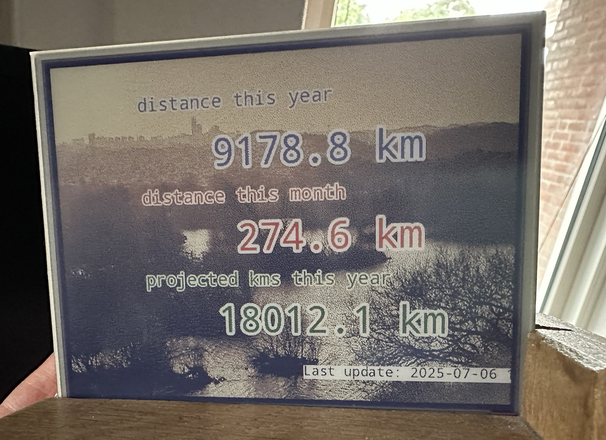

# StravaInky
Displaying Strava stats on a Inky Impressions e-ink display

# Tutorial
This is how I've ran it.

## Hardware
You need a Raspberry Pi with Python 3.10 or higher.
I've ran this successfully on a Raspberry Pi 4 and a Raspberry Pi Zero 2.
This ran successfully on Inky Impressions 5.7 and 7.3 e-ink displays.

## Install uv
Nowadays I use the uv package manager.
You find instructions how to install uv here: [https://docs.astral.sh/uv/#highlights](https://docs.astral.sh/uv/#highlights)

## Make a directory for the Python code.

        mkdir PythonProjects
        uv init StravaInky
        cd StravaInky

## Copy the files from this repo to the StravaInky directory.

## Follow Strava's Getting Started guide to create an app, and get authentication
Follow Strava's guide: https://developers.strava.com/docs/getting-started/
This way you should get a client_id and client_secret.

## Add Python packages to the project
        uv add -r requirements.txt

Note that I chose to use an older version of the inky package. I'm getting this error with the later package versions:
        Woah there, some pins we need are in use!
        ⚠️   Chip Select: (line 8, GPIO8) currently claimed by spi0 CS0

## Create a .env file in the project folder
It should have the following contents:  

        STRAVA_CLIENT_ID='<your Strava client_id>'  
        STRAVA_CLIENT_SECRET='<your Strava client_secret>'  
        REDIRECT_URI = 'http://localhost'  
        STRAVA_REFRESH_TOKEN = '<refresh token>'  

## Try to run the Strava Inky dashboard

        uv run src/stravainky/stravainky_dashboard.py

